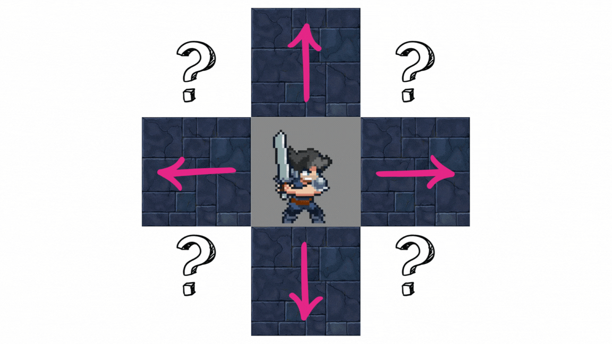
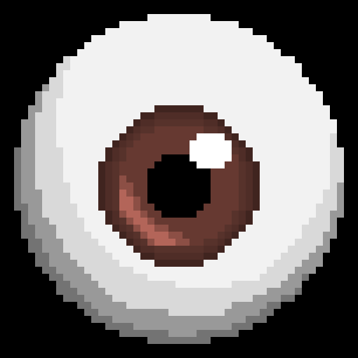
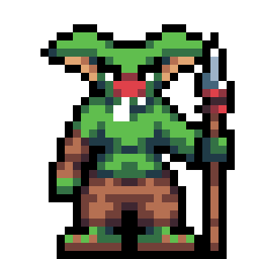
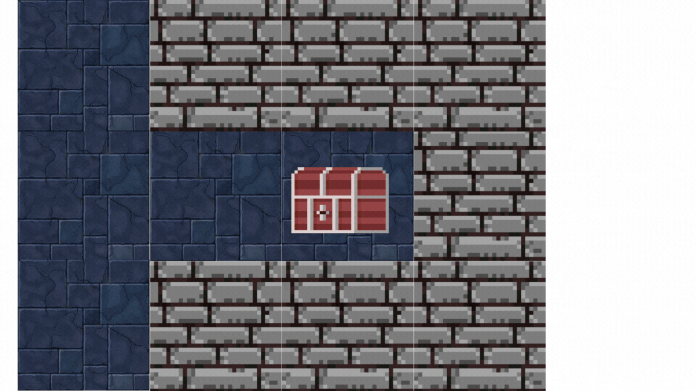

## Introducción

Este proyecto es un generador de dungeons, que utiliza un algoritmo de caminata aleatoria para crear mapas únicos e impredecibles. El uso de caminatas aleatorias para la generación de mapas es una técnica poderosa porque proporciona una gran cantidad de variabilidad y complejidad con un método relativamente simple. Esto asegura que cada mapa generado sea siempre distinto, creando una nueva experiencia por cada generación y manteniendo el juego impredecible y desafiante.

La idea detrás de la generación aleatoria de mapas es imitar la complejidad y la imprevisibilidad de los mundos reales o imaginarios. Al no saber qué esperar a la vuelta de cada esquina, los jugadores se mantienen comprometidos y el sentido de exploración y descubrimiento permanece en el corazón de la experiencia del juego.

## Caminata Aleatoria

Una caminata aleatoria es un proceso matemático que consiste en tomar una serie de pasos, donde cada paso se toma en una dirección aleatoria. En el contexto de la generación de dungeons, esto se traduce en la creación de pasillos y habitaciones que se extienden desde un punto de origen en direcciones aleatorias.

En este código se buscará una forma de generar un pasillo por un dungeon con caminatas aleatorias. Para ello se tomará en cuenta 3 cosas importantes:

1. Una vez que se avance a una nueva posición, no se podrá regresar. Esto para evitar que se sobreescriban los caminos y se genere un Dungeon congruente.
2. Ya que una sola caminata puede crear un Dungeon que parezca lombriz (ya que serían pasillos delgados), se intentará crear ramas con nuevos pasillos de lugares al azar.
3. Se intentará generar distintos elementos dentro del dungeon: enemigos, vidas y tesoros. Los enemigos no podrán estar demaciado cerca del spawn del Héroe y los cofres tampoco tan cerca del Boss Final. Las vidas se generarán compeltamente al azar dentro del mapa. Los tesoros únicamente podrán spawnear en pasillos sin salida del dungeon.

### Implementación en el Código

La función `pasoAleatorio` es el núcleo de la generación de pasillos. Partiendo de una posición inicial, esta función genera una secuencia de pasos dentro del canvas. Cada paso se elige al azar de un conjunto de direcciones posibles (norte, este, sur, oeste), asegurándose de que cada nueva posición no se salga de los límites del canvas y no sobreescriba un camino ya existente. Para esto se utiliza una función de validación `validacionPaso`, que nos permite filtrar las direcciones posibles para continuar. Cada bloque del canvas se guarda con un valor booleano que nos permite ver si el bloque ya está en el Dungeon o no. Una vez que se termina el número de pasos para general el dungeon o se llega a un punto sin direcciones disponibles, el algoritmo acaba. En el punto inicial como en el punto final se renderizan imágenes específicas, el Heroe y el Jefe Final respectivamente.

Una única caminata aleatoria no nos deja crear Dungeons complejos, por eso se decidió crear una camianta aleatoria con ramificaciones. Las ramificaciones se crean permitiendo que la función `pasoAleatorio` se llame a sí misma desde diferentes puntos a lo largo del camino principal, lo que lleva a la creación de caminos secundarios que se extienden desde el camino principal. La creación de estos caminos secundarios también es completamente aleatorio, con una probabilidad del 30% de crear nuevos pasillos. Esto permite crear Dungeons más grandes y complejos.

## Generación de Elementos

La generación de elementos como cofres, corazones y goblins se maneja a través de una serie de funciones dedicadas que colocan estos elementos en el mapa, una vez que ya se haya generado por completo. Estas funciones son:

- `colocarGoblins`: Esta función revisa todo el Dungeon creado y propone propone 10 lugares para 10 goblins. Si el lugar cumple que la distancia entre el spawn y el goblin es de más de 5 unidades, entonces se renderiza, si no entonces lo descarta. Para esto se utilizó una función que nos permitiera calcular la norma euclidiana entre el goblin y el spawn.

- `colocarCofresEnExtremos`: Esta función coloca cofres en los extremos de los pasillos, creando un incentivo para que los jugadores exploren el dungeon completamente. Para ello se verifican todos los bloques de dungeon y se busca si cumple con la condición de estar rodeado de bloques con booleano false, que significaría que es un pasillo sin salida.

- `colocarCorazones`: Esta función agrega corazones en lugares aleatorios, proporcionando al jugador recursos que pueden ser esenciales para su supervivencia en el juego.

## Referencias
Las imágenes utilizadas fueron sacadas de Google.